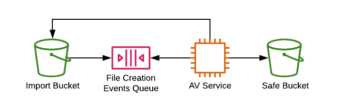

# s3 AntiVirus

## Description

Service is based on `ClamAV` anti-virus software.
The workflow is:

1. Object is created in `import-bucket`.
2. S3 sends bucket notification to the SQS `av-queue`.
3. AV Service pulls the message from the SQS.
4. AV Service pulls the file from `import-bucket`.
5. AV Service puts `IN_PROGRESS` tag on pulled s3 object.
6. AV Service performs anti-virus scan on pulled file.
7. AV Service puts the proper tag on s3 object based on scan results and copies file to `safe-bucket` if file is not infected.
8. AV service deletes the file from host.
9. AV service deletes processed message from SQS.

## Service diagram

## Running locally

Just install the dependencies in for avService by running `npm install` inside `./avService`, then run `docker-compose up` from root.
`Seeder` container will provision all required AWS infrastructure inside localstack with terraform.

You can triggers the service by calling `./test.sh cp_file`. Check the script for more handy commands.
